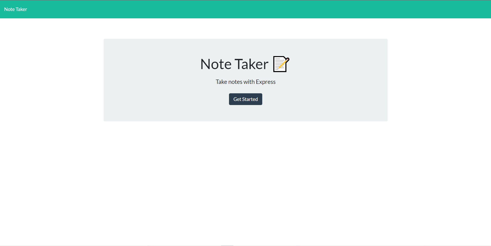
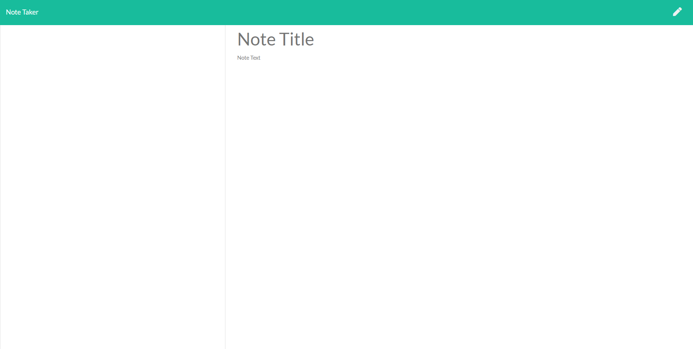

# Note Taker App

The Note Taker App is a simple web application that allows users to create, save, and delete notes. It provides a user-friendly interface for managing notes efficiently.

## Getting Started

To run the Note Taker App on your local machine, follow these steps:

1. Clone this repository to your local machine:

git clone https://github.com/AlanPaccor/note-taker-app.git

cd note-taker-app,
npm install,
node server.js

### Open your web browser and access the application at http://localhost:3000.

### Features
- Create new notes by providing a title and text content.
- Save notes to the server to keep track of them.
- View existing notes by clicking on them in the sidebar.
- Delete notes when they're no longer needed.

### Technologies Used
- HTML/CSS: Used for creating the user interface of the application.
- JavaScript: Used for client-side scripting and interaction.
- Express.js: Used to create the server and handle routes.
- Bootstrap: Used for styling the application.
- jQuery: Used for simplifying DOM manipulation and event handling.

### Directory Structure
The project's directory structure is organized as follows:

- `public/` - Contains public assets like HTML, CSS, and JavaScript files.
  - `index.html` - Landing page of the app.
  - `notes.html` - Page for viewing and managing notes.
  - `assets/` - Contains CSS and JavaScript assets.
    - `css/` - Contains stylesheets.
    - `js/` - Contains client-side scripts.
- `routes/` - Contains server-side route handling.
  - `apiRoutes.js` - Defines routes for API interactions.
  - `htmlRoutes.js` - Defines routes for serving HTML files.
- `db/` - Contains the database file.
  - `db.json` - Stores the notes data.
- `server.js` - Main entry point of the server.

### Contributing
Contributions are welcome! If you find a bug or want to enhance the app, feel free to open an issue or submit a pull request.

### License
This project is licensed under the MIT License.
